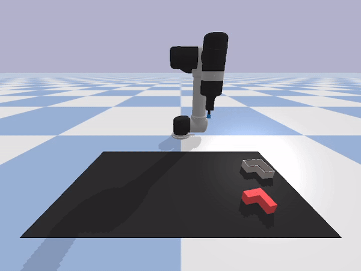

# RECVIS-transporter-networks

This repository is my work on the course *Object Recognition and Computer Vision* given at the MVA by Jean Ponce, Ivan Laptev, Cordelia Schmid and Josef Sivic.


## Objective

### Transporter Networks

Firstly, we use the Transporter Networks published in this [article](https://arxiv.org/abs/2010.14406). 
This new type of network aims at achieving state-of-the-art performances on robotic manipulation tasks. 
This idea is to decompose a robotic manipulation in 2 steps:
* a pick step where the robot picks an object. Transporter Networks uses an equivariant attention network based on Resnet for such steps.
* a place step conditionned by the pick step where the robot puts down the picked object. 
Transporter networks uses an action-value function invariant to the pick step.
Thanks to the 2 equivariant and invariant properties, the transporter networks are highly sample-efficient.

The authors have published [ravens](https://github.com/google-research/ravens/tree/master/ravens): a python framework to simulate
10 robot manipulation tasks. In this work, we will focus on 2 tasks:
* `block-insertion`: the robot needs to pick a L-shaped object and put it on a L-shaped support
* `manipulating-rope`: the robot needs to manipulate a rope so that it finishes the incomplete
perimeter of a square.

### Depth ablation study 

Transport networks uses RGB-Depth images. While obtaining depth images is getting easier, it is still preferable to only use RGB images.

We develop 2 ways of deleting depth information.

#### Soft deletion

Here, we only delete the depth information, right before it is given to the transporter network, after the top down reconstruction.


#### Hard deletion

Here, we directly estimate the depth from RGB images, before the top down reconstruction. We use the AdaBins framework published in this [article](https://arxiv.org/abs/2011.14141), to predict depth on RGB images.


The authors have published the algorithm inside this [repository](https://github.com/shariqfarooq123/AdaBins).

## Installation

The repository uses 2 different packages:
* `ravens`: a gym-like framework which implements transporter networks. 
It uses `tensorflow==2.3`, which works best wih `cuda-10.1`. 
This version of cuda is going to be the primary one.
* `AdaBins`: a repository which implements Adabins. 
It uses `torch==1.8`, which works best/only with `cuda-10.2` 
This version of cuda is going to be the secondary one. 

In the installation process, you will need to:
* install the nvidia drivers
* install `cudnn7`, used for `cuda-10.1`
* install 2 versions of cuda. Check this [link](https://medium.com/@peterjussi/multicuda-multiple-versions-of-cuda-on-one-machine-4b6ccda6faae)
  * install `cuda-10.1`
  * install `cuda-10.2`
  * update your env variable `$LD_LIBRARY_PATH`
  * update your symlink at `/usr/local/cuda` so that it points towards `/usr/local/cuda-10.1`

### Installing cuda

Basic script to install `cuda-10.2`. Check this [link](https://developer.nvidia.com/cuda-toolkit-archive) for more information.
You also need to install `cuda-10.1`.

```{bash}
# Install cuda-10.2
wget https://developer.download.nvidia.com/compute/cuda/repos/ubuntu1804/x86_64/cuda-ubuntu1804.pin
sudo mv cuda-ubuntu1804.pin /etc/apt/preferences.d/cuda-repository-pin-600
wget https://developer.download.nvidia.com/compute/cuda/10.2/Prod/local_installers/cuda-repo-ubuntu1804-10-2-local-10.2.89-440.33.01_1.0-1_amd64.deb
sudo dpkg -i cuda-repo-ubuntu1804-10-2-local-10.2.89-440.33.01_1.0-1_amd64.deb
sudo apt-key add /var/cuda-repo-10-2-local-10.2.89-440.33.01/7fa2af80.pub
sudo apt-get update
sudo apt-get -y install cuda-10-2
```

```{bash}
# Add symlink to cuda-10.1
cd /usr/local
sudo rm cuda
ln -s cuda-10.1 cuda
```

### Install Pytorch3d

```{bash}
curl -LO https://github.com/NVIDIA/cub/archive/1.10.0.tar.gz
tar xzf 1.10.0.tar.gz
export CUB_HOME=$PWD/cub-1.10.0
pip install "git+https://github.com/facebookresearch/pytorch3d.git"
```

### Installation of the packages

Then you can simply install the repository and its submodules

```{bash}
# Clone the repository 
git clone --recurse-submodules git@github.com:MatiasEtcheve/RECVIS-transporter-networks.git

# install the project requirements
pip install -r requirements.txt

# install ravens
pip install -r ravens/requirements.txt
pip install -e ravens/ # editable version
```

In order to install AdaBins you will need to create a setup file:

```{bash}
echo -e 'from setuptools import find_packages, setup

setup(
    name="adabins",
    version="0.0.1",
    packages=find_packages(),
    python_requires=">=3.6",
)' >> AdaBins/setup.py

mkdir AdaBins/adabins
mv -v AdaBins/* -t AdaBins/adabins
mv -t AdaBins AdaBins/adabins/setup.py AdaBins/adabins/README.md AdaBins/adabins/LICENSE
```

And then install it, so you can directly run `from adabins import ...`:

```{bash}
pip install -e AdaBins/ # editable version
```

### Download the data

#### Download the dataset 

You can directly download the dataset from Ravens. Here is how to fetch them:

```{bash}
mkdir dataset
wget https://storage.googleapis.com/ravens-assets/block-insertion.zip -P dataset/
unzip dataset/block-insertion
wget https://storage.googleapis.com/ravens-assets/manipulating-rope.zip -P dataset/
unzip dataset/manipulating-rope
```

#### Download the pretrained models for AdaBins

The repository uses BinsFormer pretrained model. You need to save it (in `checkpoints/` for instance.)

```{bash}
mkdir AdaBins/adabins/pretrained
gdown "1HMgff-FV6qw1L0ywQZJ7ECa9VPq1bIoj&confirm=t" -O AdaBins/adabins/pretrained/ # download kitty model
gdown "1lvyZZbC9NLcS8a__YPcUP7rDiIpbRpoF&confirm=t" -O AdaBins/adabins/pretrained/ # download nyu model
```

> Note: if you have an error like `Cannot retrieve the public link of the file`, check this [thread](https://github.com/wkentaro/gdown/issues/43).


## Working tree

After the installation process, you should have something looking like:

```{bash}
.
├── AdaBins/ # AdaBins Framework
│   ├── LICENSE
│   ├── README.md
│   ├── adabins/
│   │   ├── pretrained/ # Contain Adabins models
│   │   │   ├── adabins_efnetb5_kitti.pth
│   │   │   └── adabins_efnetb5_nyu.pth
│   │   ├── ...
│   └── setup.py
├── dataset/ # Dataset for the 2 simulated tasks
│   ├── block-insertion-test/
│   │   ├── action/
│   │   ├── color/
│   │   ├── depth/
│   │   ├── info/
│   │   └── reward/
│   ├── block-insertion-train/
│   │   ├── ...
│   ├── manipulating-rope-test/
│   │   ├── ...
│   └── manipulating-rope-train/
│       ├── ...
├── ravens/
│   ├── setup.py
│   └── ...
├── RGB/
│   ├── logs/
│   └── predictions/
├── RGB-Depth/
│   ├── checkpoints/
│   ├── logs/
│   └── predictions/
├── RGB-Estimated Depth/
│   ├── logs/
│   └── predictions/
├── agent_visualisation.ipynb # visualize what an agent does with `pybullet`
├── requirements.txt # requirements of the project. Maybe not exact
└── training_visualisation.ipynb # plots curves
```

Each `RGB-Depth`, `RGB` and `RGB-Estimated Depth` folders contain the results of the original transporter networks and the 2 ablation studies: soft and hard deletion.

They each contains the logs of the training and the predictions ran on the test sets of each tasks.

## Results

With this repository, I was able to reproduce the results stated by the transport network authors. 
Specifically, here are some observed policies.

**On *block-insertion* task:**

| Before training | After training |
|---|---|
|  |  |

| Slowest success | Typical fail |
|---|---|
|  |  |

**On *block-insertion* task:**

| Before training | After training |
|---|---|
|  |  |

| Fastest success | Slowest success | Typical fail | 
|---|---|---|
|  |  |  |